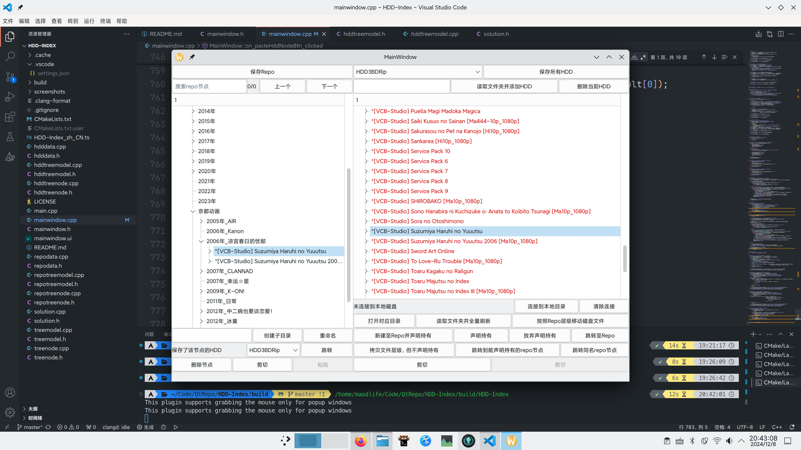

# HDD-Index

HDD Index is a Qt/C++ program that can organize and browse disk indexes.

## Milestone

### Finished

- [x] 复制文件层级，但不声明持有
- [x] 放弃声明持有
- [x] 跳转到能声明持有的repo节点
- [x] 启动时把model也创建了
- [x] 删除节点时删除saveData信息
- [x] 搜索节点
- [x] 把UIdata放进mainwindow里
- [x] 尝试打开HDD节点对应的本地文件夹
- [x] hdd tree view的剪切，粘贴操作
- [x] 链接到实际磁盘，并调整文件层级
- [x] 展开所有节点
- [x] 读本地文件并刷新hddData

### High Priority

- [ ] 重命名repo节点, 同时更新相关信息
- [ ] HDD节点标记为可删除

### Low Priority

- [ ] 跳转时自动切换HDD combo box
- [ ] 拖放节点
- [ ] 多语言支持
