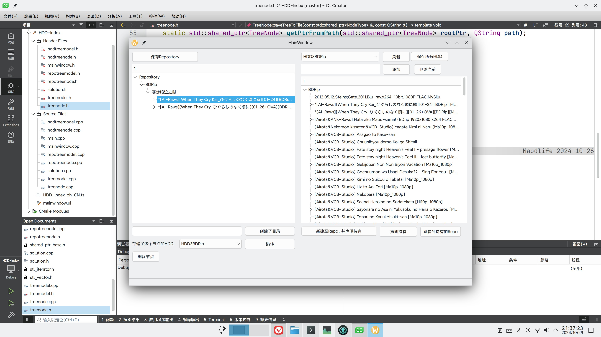

# HDD-Index

HDD Index is a Qt/C++ program that can organize and browse disk indexes.

## Milestone

### Finished

- [x] 复制文件层级，但不声明持有
- [x] 放弃声明持有
- [x] 跳转到能声明持有的repo节点

### High Priority
- [ ] 链接到实际磁盘，并刷新、调整文件层级

### Low Priority

- [ ] 拖放节点
- [ ] 重命名repo节点
- [ ] 删除节点时删除saveData信息
- [ ] 多语言支持
