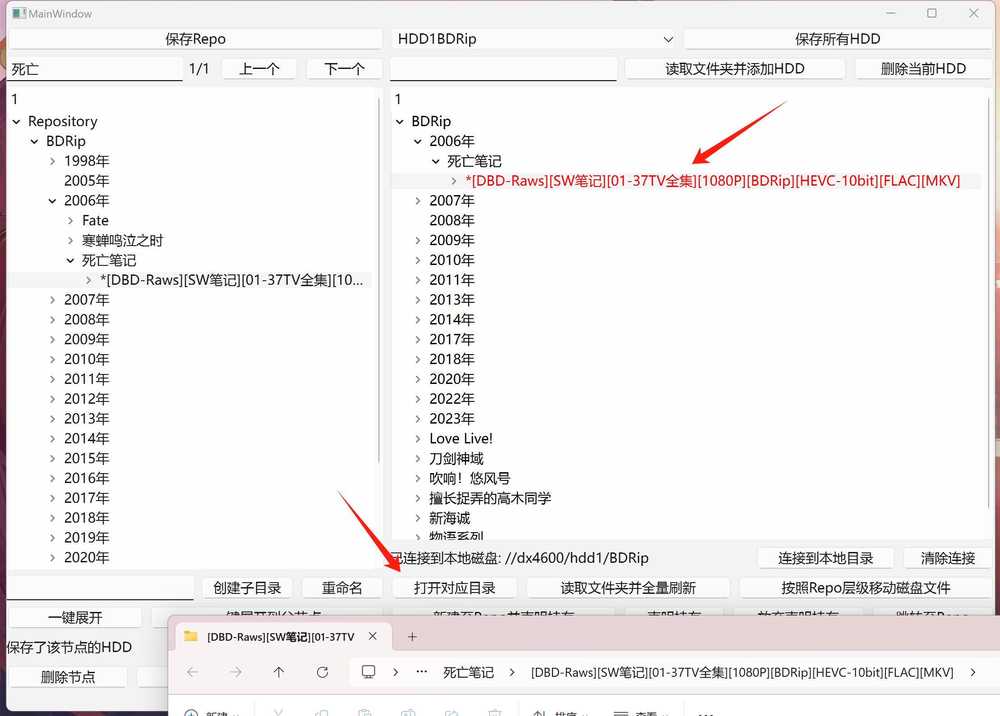

# HDD-Index

HDD Index is a Qt/C++ program that can organize and browse disk indexes.

目录

- [Introduction](#introduction)
- [Usage](#usage)
- [MileStone](./milestone.md/#milestone)

## Introduction

本软件基于这样一种使用场景：

我有许多影视资源/动画蓝光，每部资源是一个独立的文件夹，大约几十GB大小，所有资源加起来的总大小可能达到10TB以上，因此分散在多个2TB/4TB的磁盘中。因为台式机空间有限，这些磁盘并不全安装在台式机的3.5寸硬盘位里，部分磁盘会作为“冷盘”存储资源使用。那么当我想要找到某一个特定的资源时，怎么找到哪一块硬盘存储了这个资源呢？于是我开发了这个软件。

例如，我已经使用这个软件对我的动画资源进行了整理，现在我想找到“死亡笔记”的资源：

1. 搜索“死亡”

2. 在左侧显示中找到前面带*的文件夹并选中（因为同一部作品可能保存了几个季度的资源或多个压制组的BDRip）

3. 在下方下拉框中发现有两块硬盘保存了这个资源，选择HDD1BDRip（这是我对这块硬盘的命名）

4. 点击跳转

这时右侧的对应文件夹被高亮选中。点击“打开对应目录”，调用文件资源管理器打开这个文件夹：

未来还将加入“备份度”检查，例如，如果将上图中的“[DBD-Raws][SW笔记]xxxx”的备份度设置为3，而软件检查到目前只有两块硬盘保存了这个文件夹，则会提醒用户再用一块硬盘去保存这个文件夹。

**为什么不使用NAS？**

虽然NAS可以通过单个大容量磁盘或RAID得到大容量空间和一定的冗余保证，但NAS的物理位置依旧只能处于一处，并不符合文件备份的“3-2-1原则”。而且整个NAS提供的空间可以视为一整块硬盘，和本软件结合使用，并不冲突（我就是这么用的）。

## Usage

// todo
